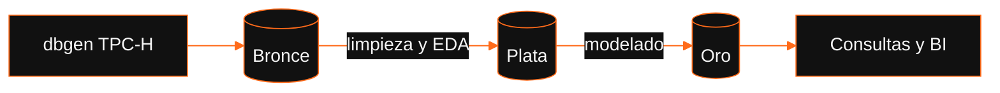
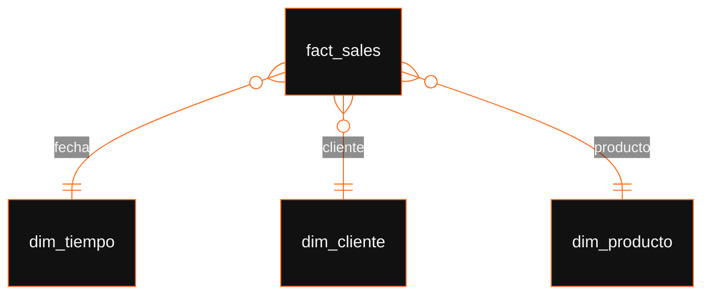

<div align="center">


<br>


**Data warehouse sobre TPC-H con capas Bronce, Plata y Oro.**

[Arquitectura](#arquitectura) &nbsp;·&nbsp; [Modelo](#modelo-dimensional) &nbsp;·&nbsp; [Ejecución](#ejecución) &nbsp;·&nbsp; [Estructura](#estructura)

</div>

<br>

## Resumen

Pipeline que genera datos con `dbgen` de TPC-H, los carga y los transforma
por capas hasta un esquema en estrella listo para análisis.

| Capa | Propósito |
|:--|:--|
| **Bronce** | Datos crudos tal como los genera `dbgen` |
| **Plata** | Limpieza: duplicados, espacios sobrantes, inconsistencias y `dwh_created_date` |
| **Oro** | Modelo dimensional para consumo analítico |

<br>

## Arquitectura



<br>

## Modelo dimensional



- **Tabla de hechos:** `fact_sales`, construida a partir de `lineitem`.
- **Llaves:** sustitutas (`_pk`) y de negocio (`_bk`).
- **Regla de carga:** solo órdenes finalizadas, con `l_receiptdate` y sin devolución.

<br>

## Ejecución

```bash
git clone https://github.com/CaletOrtiz/sql-datawarehouse-project.git
cd sql-datawarehouse-project

# 1. Generar datos (factor de escala 1 ≈ 1 GB)
./dbgen -s 1

# 2. Cargar Bronce
# 3. Transformar a Plata
# 4. Construir Oro
```

> [!NOTE]
> Completa los pasos 2 a 4 con el nombre de tus scripts.

<br>

## 🛠️ Estructura del Repositorio

```text
├── data/              # Carpeta ignorada en Git (almacena el .sqlite local)
├── docs/              # Documentación técnica: arquitectura, ERD por capa, proceso ETL
├── scripts/           # SQL de las capas bronce, plata y oro
│   ├── bronce/        # DDL + carga de fuentes .tbl
│   ├── plata/         # Checks de calidad + DDL + ETL bronce→plata
│   └── oro/           # DDL estrella + ETL plata→oro
├── etl/               # Mapeo y scripts del proceso ETL / Limpieza
├── dashboard/         # Capturas de pantalla, reportes y archivos del Dashboard
├── .gitignore         # Configuración para ignorar archivos de datos pesados
└── README.md          # Descripción general del proyecto
```
<br>

---

<div align="center"><sub>Hecho por <a href="https://github.com/CaletOrtiz">Calet Ortiz</a></sub></div>


