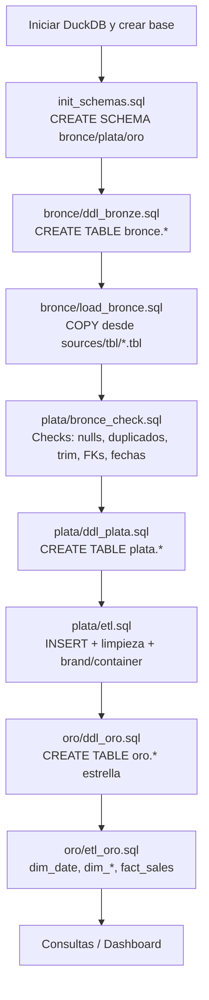
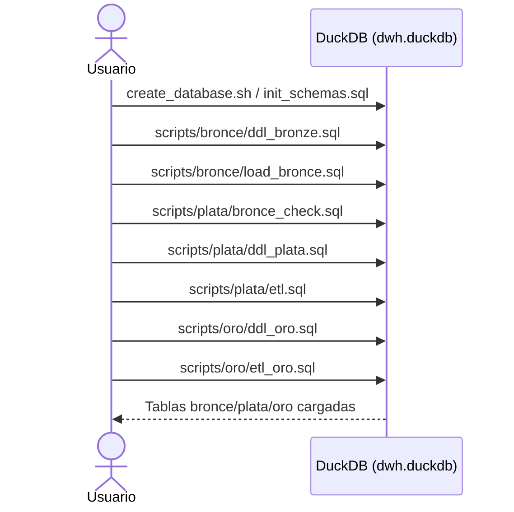

# Arquitectura del Data Warehouse

## Diagrama general (Medallion Architecture)

```mermaid
flowchart LR
    subgraph SRC["Fuentes (sources/tbl)"]
        T1[nation.tbl]
        T2[region.tbl]
        T3[part.tbl]
        T4[supplier.tbl]
        T5[partsupp.tbl]
        T6[customer.tbl]
        T7[orders.tbl]
        T8[lineitem.tbl]
    end

    subgraph BRONCE["Capa BRONCE (raw)"]
        B[Tablas espejo sin transformaciones<br/>COPY CSV con delimitador pipe]
    end

    subgraph PLATA["Capa PLATA (cleansed)"]
        P1[Limpieza: TRIM, NULLs, fechas válidas]
        P2[Normalización: dimas brand / container]
        P3[dwh_created_date auditoría]
    end

    subgraph ORO["Capa ORO (star schema)"]
        O1[dim_date]
        O2[dim_customer]
        O3[dim_product]
        O4[fact_sales]
    end

    DB[(DuckDB<br/>data/dwh.duckdb)]

    SRC -->|COPY CSV delimitador pipe| BRONCE
    BRONCE -->|etl.sql: limpieza y validación| PLATA
    PLATA -->|etl_oro.sql: modelado dimensional| ORO
    BRONCE -.->|bronce_check.sql| CHK[(Checks de calidad)]
    ORO --> DB
```

## Flujo de carga ETL

```mermaid
flowchart TD
    A[Iniciar DuckDB y crear base] --> B[init_schemas.sql<br/>CREATE SCHEMA bronce/plata/oro]
    B --> C[bronce/ddl_bronze.sql<br/>CREATE TABLE bronce.*]
    C --> D[bronce/load_bronce.sql<br/>COPY desde sources/tbl/*.tbl]
    D --> E[plata/bronce_check.sql<br/>Checks: nulls, duplicados, trim, FKs, fechas]
    E --> F[plata/ddl_plata.sql<br/>CREATE TABLE plata.*]
    F --> G[plata/etl.sql<br/>INSERT + limpieza + brand/container]
    G --> H[oro/ddl_oro.sql<br/>CREATE TABLE oro.* estrella]
    H --> I[oro/etl_oro.sql<br/>dim_date, dim_*, fact_sales]
    I --> J[Consultas / Dashboard]
```

## Secuencia de ejecución

```mermaid
sequenceDiagram
    actor U as Usuario
    participant D as DuckDB (dwh.duckdb)
    U->>D: create_database.sh / init_schemas.sql
    U->>D: scripts/bronce/ddl_bronze.sql
    U->>D: scripts/bronce/load_bronce.sql
    U->>D: scripts/plata/bronce_check.sql
    U->>D: scripts/plata/ddl_plata.sql
    U->>D: scripts/plata/etl.sql
    U->>D: scripts/oro/ddl_oro.sql
    U->>D: scripts/oro/etl_oro.sql
    D-->>U: Tablas bronce/plata/oro cargadas
```
