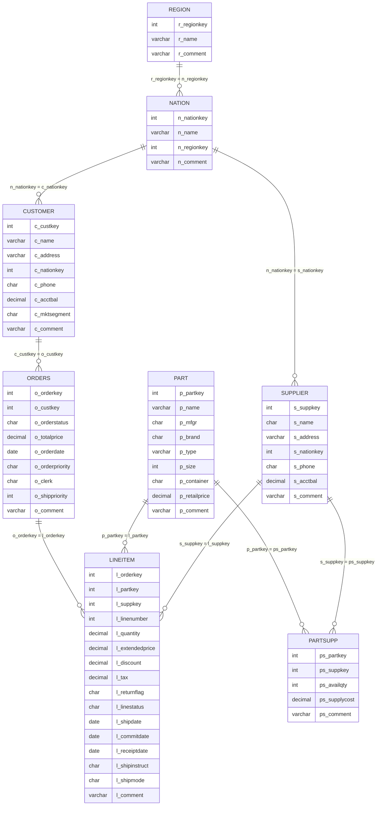

# Modelo de Datos — Capa BRONCE

Datos crudos tal como llegan de los archivos `.tbl` (TPC-H), sin transformaciones.

```mermaid
erDiagram
    REGION ||--o{ NATION : "r_regionkey = n_regionkey"
    NATION ||--o{ CUSTOMER : "n_nationkey = c_nationkey"
    NATION ||--o{ SUPPLIER : "n_nationkey = s_nationkey"
    CUSTOMER ||--o{ ORDERS : "c_custkey = o_custkey"
    ORDERS ||--o{ LINEITEM : "o_orderkey = l_orderkey"
    PART ||--o{ PARTSUPP : "p_partkey = ps_partkey"
    SUPPLIER ||--o{ PARTSUPP : "s_suppkey = ps_suppkey"
    PART ||--o{ LINEITEM : "p_partkey = l_partkey"
    SUPPLIER ||--o{ LINEITEM : "s_suppkey = l_suppkey"

    REGION {
        int r_regionkey
        varchar r_name
        varchar r_comment
    }
    NATION {
        int n_nationkey
        varchar n_name
        int n_regionkey
        varchar n_comment
    }
    PART {
        int p_partkey
        varchar p_name
        char p_mfgr
        char p_brand
        varchar p_type
        int p_size
        char p_container
        decimal p_retailprice
        varchar p_comment
    }
    SUPPLIER {
        int s_suppkey
        char s_name
        varchar s_address
        int s_nationkey
        char s_phone
        decimal s_acctbal
        varchar s_comment
    }
    PARTSUPP {
        int ps_partkey
        int ps_suppkey
        int ps_availqty
        decimal ps_supplycost
        varchar ps_comment
    }
    CUSTOMER {
        int c_custkey
        varchar c_name
        varchar c_address
        int c_nationkey
        char c_phone
        decimal c_acctbal
        char c_mktsegment
        varchar c_comment
    }
    ORDERS {
        int o_orderkey
        int o_custkey
        char o_orderstatus
        decimal o_totalprice
        date o_orderdate
        char o_orderpriority
        char o_clerk
        int o_shippriority
        varchar o_comment
    }
    LINEITEM {
        int l_orderkey
        int l_partkey
        int l_suppkey
        int l_linenumber
        decimal l_quantity
        decimal l_extendedprice
        decimal l_discount
        decimal l_tax
        char l_returnflag
        char l_linestatus
        date l_shipdate
        date l_commitdate
        date l_receiptdate
        char l_shipinstruct
        char l_shipmode
        varchar l_comment
    }
```
