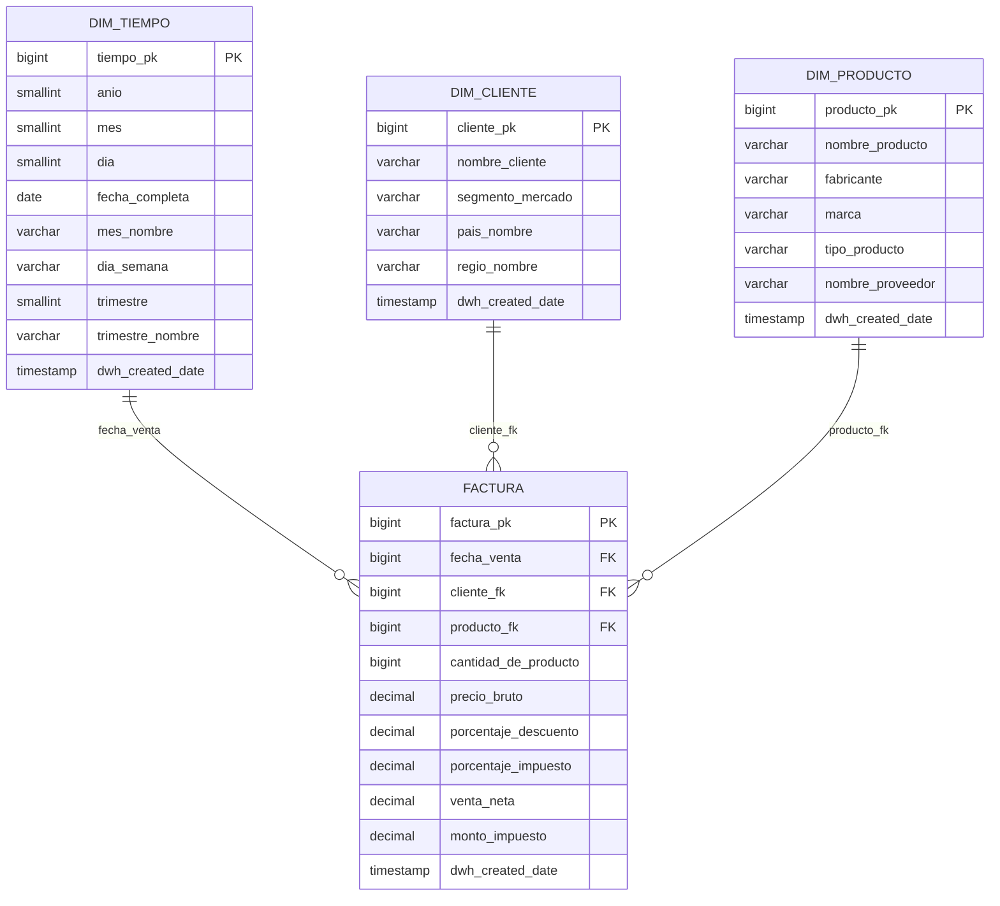

# Modelo de Datos — Capa ORO (Esquema Estrella)

## Cómo armarlo

| Entidad | Origen en plata | Transformaciones |
|---|---|---|
| `dim_tiempo` | fechas de `tbl_orders` y `tbl_lineitem` | calendario 1992-01-01 a 1997-12-01 con `generate_series`, atributos de fecha (año, mes, día, trimestre) |
| `dim_cliente` | `tbl_customer` + `tbl_nation` + `tbl_region` | aplanado de país y región |
| `dim_producto` | `tbl_part` + `tbl_brand` + `tbl_partsupp` + `tbl_supplier` | denormalización de marca y nombre del proveedor (proveedor más económico vía `ps_supplycost`) |
| `factura` | `tbl_lineitem` JOIN `tbl_orders` | `venta_neta = precio_bruto * (1 - descuento)`, `monto_impuesto = venta_neta * impuesto` |
