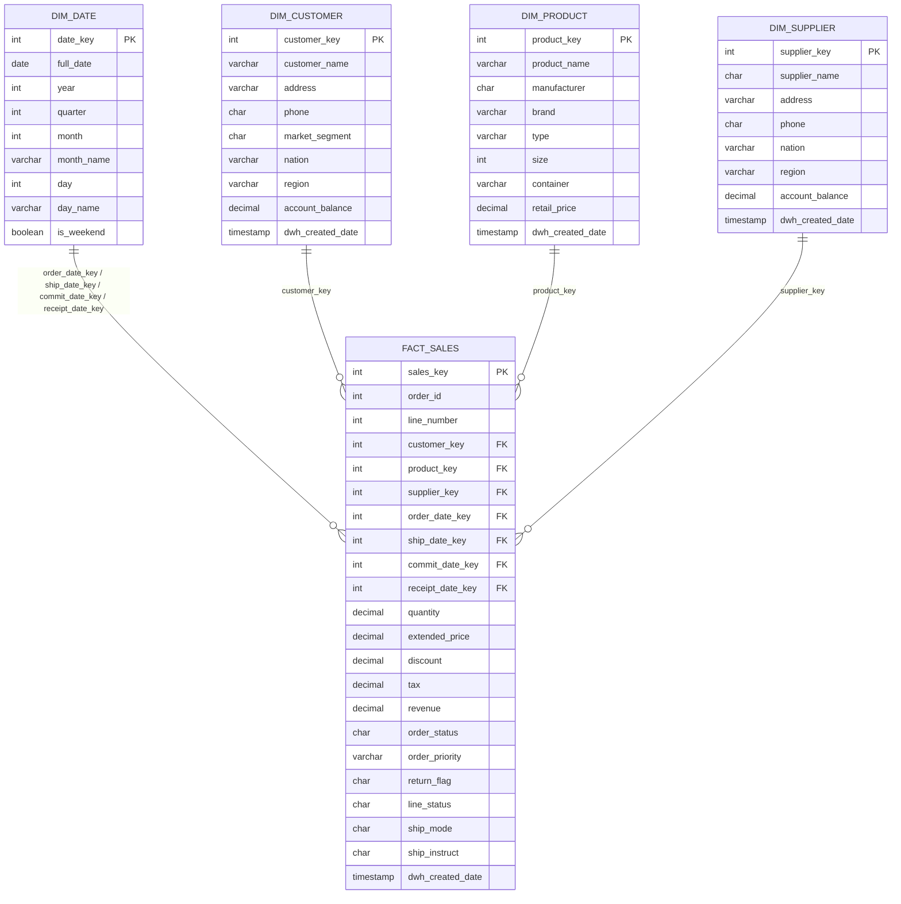

# Modelo de Datos — Capa ORO (Esquema Estrella)

## Cómo armarlo

| Entidad | Origen en plata | Transformaciones |
|---|---|---|
| `dim_date` | fechas de `tbl_orders` y `tbl_lineitem` | calendario con `generate_series`, atributos de fecha (año, mes, día, fin de semana) |
| `dim_customer` | `tbl_customer` + `tbl_nation` + `tbl_region` | aplanado de nación y región, denormalización |
| `dim_product` | `tbl_part` + `tbl_brand` + `tbl_container` | denormalización de marca y contenedor |
| `dim_supplier` | `tbl_supplier` + `tbl_nation` + `tbl_region` | aplanado de nación y región |
| `fact_sales` | `tbl_lineitem` JOIN `tbl_orders` | métricas: `revenue = extended_price * (1 - discount) * (1 + tax)` |
