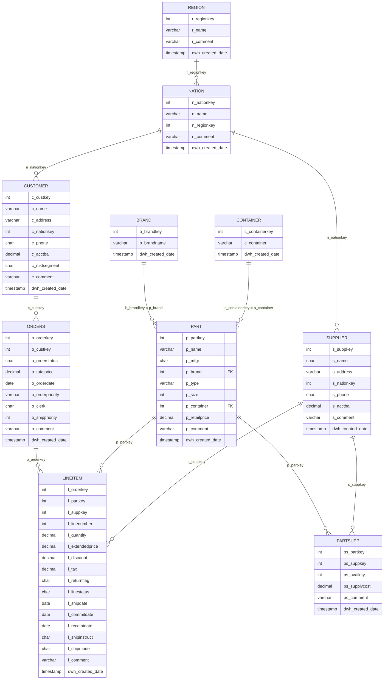

# Modelo de Datos — Capa PLATA

Misma estructura que bronce + limpieza (TRIM, tipos DECIMAL(3,2) en discount/tax,
normalización de marca y contenedor en tablas catálogo) y columna de auditoría
`dwh_created_date`.

