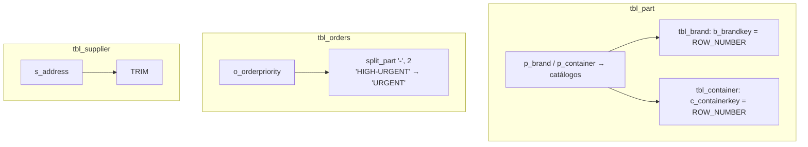
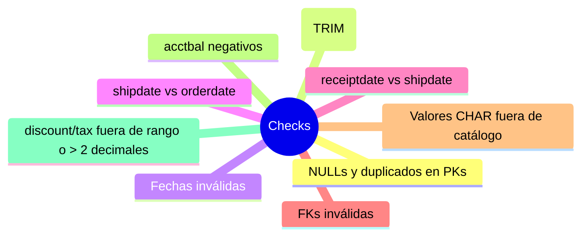

# Proceso ETL — Capa por capa

```mermaid
flowchart LR
    subgraph E1["BRONCE: Extract + Load"]
        A1[Archivos .tbl<br/>sources/tbl] -->|COPY CSV '|'| A2[bronce.tbl_*]
    end

    subgraph E2["PLATA: Transform + Load"]
        B1[bronce_check.sql<br/>checks de calidad] --> B2[etl.sql<br/>TRIM, filtros NULL,<br/>normalización brand/container,<br/>SPLIT_PART orden, fechas válidas]
        B2 --> B3[plata.tbl_*]
    end

    subgraph E3["ORO: Modelar + Load"]
        C1[etl_oro.sql<br/>dims + fact_sales<br/>revenue calculado] --> C2[oro.*<br/>star schema]
    end

    E1 --> E2 --> E3
```

## Detalle por tabla (plata)



## Checks de calidad (bronce_check.sql)



## Comandos para ejecutar todo

```bash
# 1. Crear base y esquemas
duckdb ./data/dwh.duckdb < ./scripts/init_schemas.sql

# 2. Bronce
duckdb ./data/dwh.duckdb < ./scripts/bronce/ddl_bronze.sql
duckdb ./data/dwh.duckdb < ./scripts/bronce/load_bronce.sql

# 3. Checks de calidad
duckdb ./data/dwh.duckdb < ./scripts/plata/bronce_check.sql

# 4. Plata
duckdb ./data/dwh.duckdb < ./scripts/plata/ddl_plata.sql
duckdb ./data/dwh.duckdb < ./scripts/plata/etl.sql

# 5. Oro
duckdb ./data/dwh.duckdb < ./scripts/oro/ddl_oro.sql
duckdb ./data/dwh.duckdb < ./scripts/oro/etl_oro.sql
```
