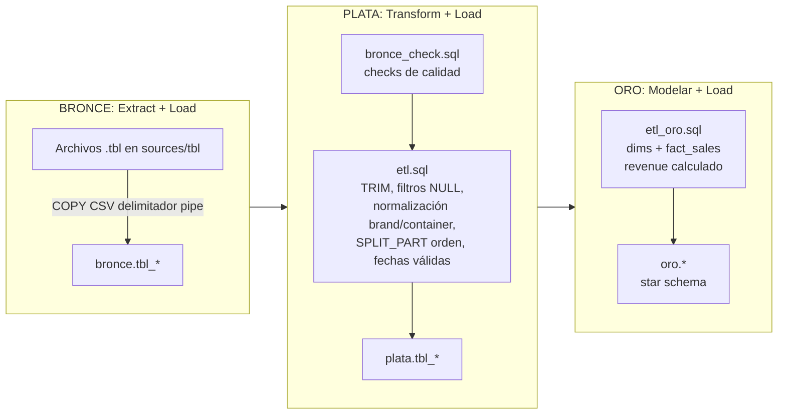
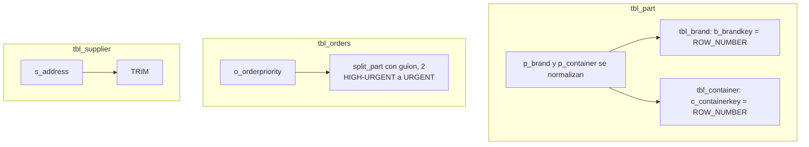
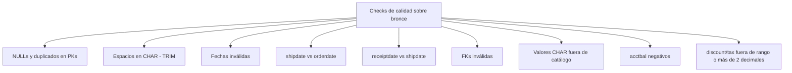

# Proceso ETL — Capa por capa



## Detalle por tabla (plata)



## Checks de calidad (bronce_check.sql)



## Comandos para ejecutar todo

```bash
# 1. Crear base y esquemas
duckdb ./data/dwh.duckdb < ./scripts/init_schemas.sql

# 2. Bronce
duckdb ./data/dwh.duckdb < ./scripts/bronce/ddl_bronze.sql
duckdb ./data/dwh.duckdb < ./scripts/bronce/load_bronce.sql

# 3. Checks de calidad
duckdb ./data/dwh.duckdb < ./scripts/plata/bronce_check.sql

# 4. Plata
duckdb ./data/dwh.duckdb < ./scripts/plata/ddl_plata.sql
duckdb ./data/dwh.duckdb < ./scripts/plata/etl.sql

# 5. Oro
duckdb ./data/dwh.duckdb < ./scripts/oro/ddl_oro.sql
duckdb ./data/dwh.duckdb < ./scripts/oro/etl_oro.sql
```
