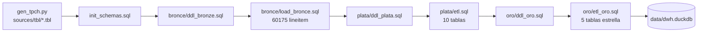
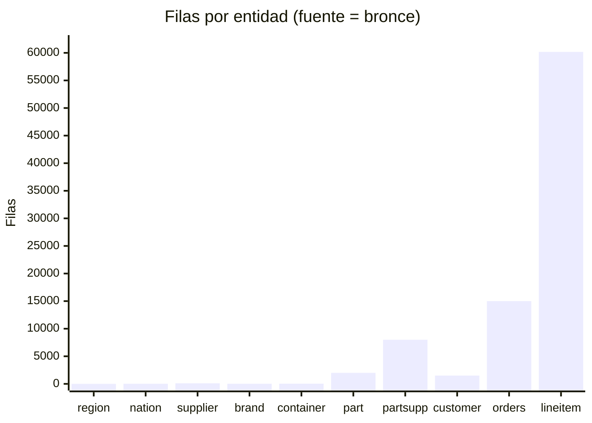

# Validación del Proceso ETL (ejecución real)

Proceso ejecutado con éxito sobre datos TPC-H de prueba (SF=0.01) el 5/10/2026
usando DuckDB 1.5.6 y los scripts del repositorio.

## Pipeline validado



## Volúmenes cargados



| Capa | Tabla | Filas |
|---|---|---|
| bronce/plata | tbl_region | 5 |
| | tbl_nation | 25 |
| | tbl_supplier | 100 |
| | tbl_brand | 25 |
| | tbl_container | 40 |
| | tbl_part | 2000 |
| | tbl_partsupp / dim_supplier | 8000 / 100 |
| | tbl_customer / dim_customer | 1500 |
| | tbl_orders | 15000 |
| | tbl_lineitem / fact_sales | 60175 |
| oro | dim_date | 2551 (1992-01-02 → 1998-12-31) |

## Consultas de ejemplo sobre ORO

```sql
-- 1. Revenue por año y quarter
SELECT d.year, d.quarter,
       ROUND(SUM(f.revenue), 2) AS revenue
FROM oro.fact_sales f
JOIN oro.dim_date d ON f.order_date_key = d.date_key
GROUP BY 1, 2 ORDER BY 1, 2;

-- 2. Top 10 clientes por revenue
SELECT c.customer_name, c.nation, ROUND(SUM(f.revenue), 2) AS revenue
FROM oro.fact_sales f
JOIN oro.dim_customer c ON f.customer_key = c.customer_key
GROUP BY 1, 2 ORDER BY 3 DESC LIMIT 10;

-- 3. Revenue por marca
SELECT p.brand, ROUND(SUM(f.revenue), 2) AS revenue
FROM oro.fact_sales f
JOIN oro.dim_product p ON f.product_key = p.product_key
GROUP BY 1 ORDER BY 2 DESC;

-- 4. Entregas fuera de tiempo (shipdate > receiptdate no; usamos commit vs receipt)
SELECT d1.full_date AS commit_date, d2.full_date AS receipt_date
FROM oro.fact_sales f
JOIN oro.dim_date d1 ON f.commit_date_key = d1.date_key
JOIN oro.dim_date d2 ON f.receipt_date_key = d2.date_key
WHERE d2.full_date < d1.full_date LIMIT 10;
```

## Buenas prácticas de ejecución

```mermaid
flowchart TD
    R[Re-ejecutar ETL completo] --> S{Existe data/dwh.duckdb?}
    S -->|Sí| DEL[Borrar archivo o usar CREATE OR REPLACE]
    S -->|No| RUN
    DEL --> RUN[duckdb data/dwh.duckdb < script.sql]
    RUN --> V[Verificar conteos con duckdb_tables()]
```
